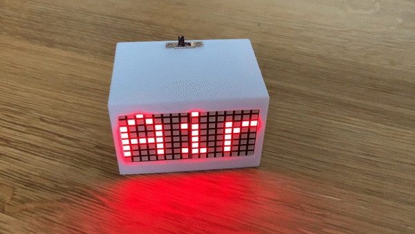

`Adafruit_LEDMatrixArray` provides an abstraction for arrays of Adafruit Bicolor 8x8 Matrices using the [Adafruit LED Backpack](https://github.com/adafruit/Adafruit_LED_Backpack) library.

```c++
#include <Adafruit_LEDBackpack.h>
#include "Adafruit_LEDMatrixArray.h"
#include "Adafruit_LEDMatrixArray.cpp"

Adafruit_BicolorMatrix displays[] = {
  Adafruit_BicolorMatrix(), Adafruit_BicolorMatrix()
};
uint8_t addresses[] = {
  0x70, 0x71
};
Adafruit_LEDMatrixArray<1,2> matrix(displays, addresses);

void setup() {
  displays[0].setRotation(3);
  displays[1].setRotation(3);
  matrix.begin();
  matrix.setTextWrap(false);
  matrix.setTextSize(1);
  matrix.setTextColor(LED_RED);
}

void loop() {
  matrix.clear();
  matrix.setCursor(0, 0);
  matrix.print("Air");
  matrix.writeDisplay();
}

```


